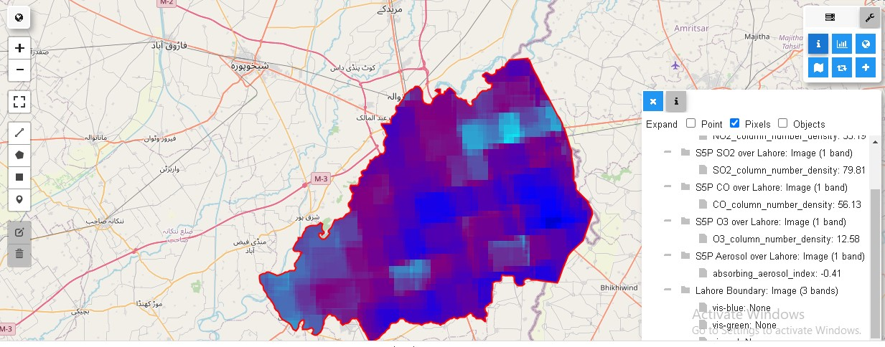
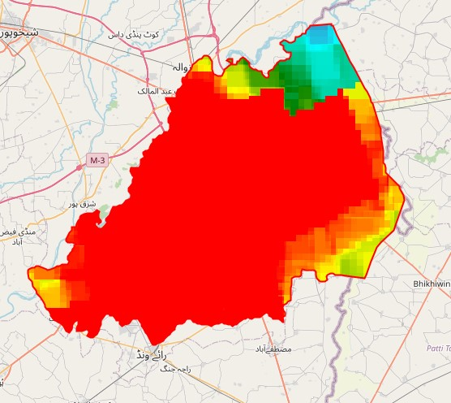
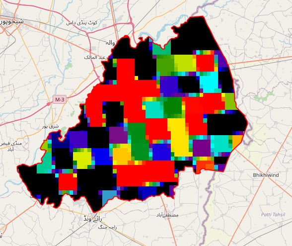
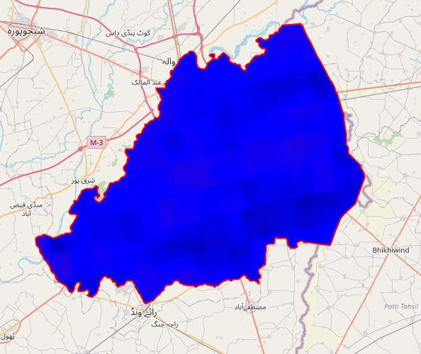
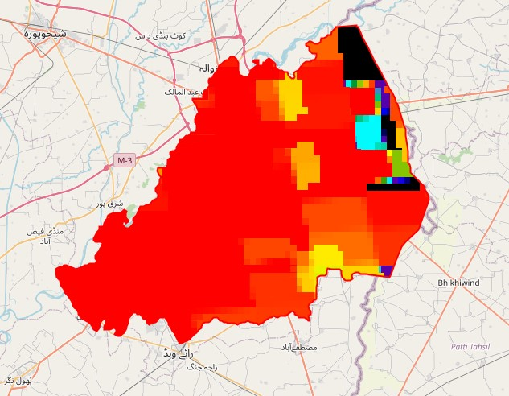
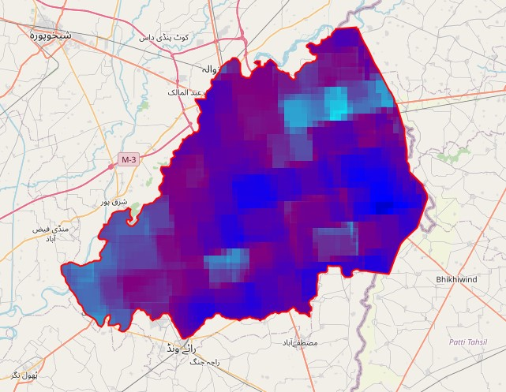

# Air Quality Index (AQI) Web Solution

An interactive web solution developed using **Google Earth Engine**, **Sentinel-5P Satellite Data**, **Python**, and **Google AQI API**, designed to visualize and analyze air quality over Lahore district. It enables users to explore real-time air quality parameters such as NO₂, SO₂, CO, O₃, and aerosols.

---

## Features

- **Real-Time AQI Visualization**
- **Sentinel-5P Satellite Data Integration**
- **Interactive Toolboxes for Gas & Date Selection**
- **Statistics of Specific Areas**
- **Visualization of Individual Gases**
- **Dynamic Data Analysis Widgets**

---

## Screenshots

### 🌐 Frontend Dashboard



---

### 🗂️ Interactive Toolbox


---

### 📊 Pollutant-Specific Visualizations

#### Nitrogen Dioxide (NO₂)


#### Sulfur Dioxide (SO₂)


#### Ozone (O₃)


#### Carbon Monoxide (CO)


#### Aerosols


---

### 📌 Area-Wise Statistics


---

### ⚙️ Gas Selection Options


---

## Tech Stack

- **Python**
- **Google Earth Engine (GEE)**
- **Sentinel-5P Satellite Data**
- **Google AQI API**
- **Geemap & Folium Libraries**
- **Streamlit for Frontend Visualization**

---

## How to Run

1. Clone the repository:
```bash
git clone https://github.com/your-username/aqi-web-solution.git
cd aqi-web-solution
```

2. Install dependencies:
```bash
pip install -r requirements.txt
```

3. Run the Streamlit app:
```bash
streamlit run app.py
```

---


---

## License

This project is licensed under the MIT License.
